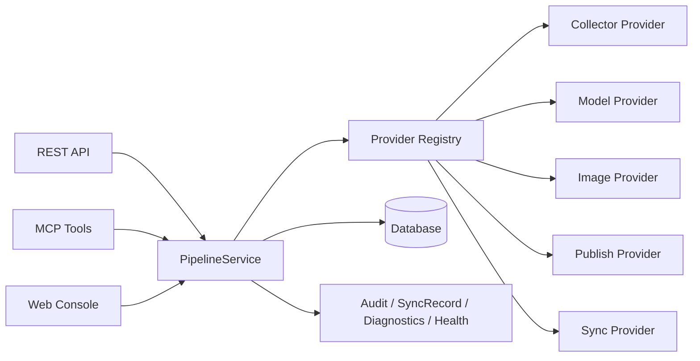

# Rednote Agent Pro

> 一个面向 **小红书内容采集、分析、生成、审核、发布与同步** 的平台型工程。  
> 使用 **OpenSpec 做规格驱动**，使用 **oh-my-codex 做代理化执行**，目标不是“一次性 Demo”，而是可持续演进的项目骨架。

<p align="center">
  
  
  
  
</p>

---

## 目录

- [项目简介](#项目简介)
- [为什么这个项目值得继续做](#为什么这个项目值得继续做)
- [核心能力](#核心能力)
- [系统架构](#系统架构)
- [OpenSpec + oh-my-codex 开发方式](#openspec--oh-my-codex-开发方式)
- [推荐开发流程](#推荐开发流程)
- [快速开始](#快速开始)
- [环境变量](#环境变量)
- [运行入口](#运行入口)
- [接口与操作台](#接口与操作台)
- [仓库结构](#仓库结构)
- [安全策略](#安全策略)
- [当前质量状态](#当前质量状态)
- [文档索引](#文档索引)
- [当前真实阻塞项](#当前真实阻塞项)

---

## 项目简介

**Rednote Agent Pro** 是一个围绕“小红书内容工作流”构建的工程化系统，覆盖以下主链路：

```text
采集 -> 分析 -> 选题 -> 草稿 -> 配图 -> 审核 -> 发布 -> 同步
```

它不是把多个脚本拼起来，而是一个明确分层、可测试、可观测、可扩展的平台：

- 有统一的 **业务中枢**：`PipelineService`
- 有统一的 **扩展机制**：provider / adapter / registry
- 有统一的 **操作入口**：REST / MCP / Web Console
- 有统一的 **审计与诊断**：run、sync、audit、health、diagnostics

这个项目适合用于：

- 学习 AI Agent + 平台架构如何结合
- 学习如何用 provider 机制接入外部系统
- 学习如何把“需求 → 规格 → 实现 → 测试 → 文档”做成闭环
- 作为作品集中的“工程化 AI 系统”项目展示

---

## 为什么这个项目值得继续做

很多 AI 项目只能展示“我调通了一个模型”或者“我写了一个自动化脚本”。

这个项目更强调的是：

### 1. 平台化，而不是脚本化

不是把 Scrapling、lark-cli、模型 SDK 直接塞进业务代码，而是全部通过 provider 边界接入。

### 2. 规格驱动，而不是边写边猜

通过 **OpenSpec** 管理设计、规格、任务和验收边界，避免项目随着对话推进不断跑偏。

### 3. 代理协作，而不是无纪律编码

通过 **oh-my-codex** 的技能、计划、验证、调试流程，让代理真正成为“长期开发协作者”，而不是一次性补丁工具。

### 4. 安全可控，而不是默认激进自动化

默认：

- 干跑优先
- 人工审核优先
- 自动发布默认关闭
- 小规模真实验证优先

这让它更像一个真实项目，而不是只适合截图展示的演示品。

---

## 核心能力

### 1）采集能力：`scrapling_xhs`

当前已接入 Scrapling 作为内部 collector provider，支持：

- `search`
- `detail`

并具备：

- fixture / dry-run 路径
- selector / extractor 归一化
- 失败分类
- 结构化 diagnostics
- 幂等入库与去重

### 2）同步能力：`feishu_cli`

当前已接入 `lark-cli` 作为统一飞书同步通道，支持：

- Base 优先同步模式
- dry-run
- 命令构建
- stdout / stderr 捕获
- SyncRun / SyncRecord 持久化
- 结构化 diagnostics

### 3）模型能力：`openai_compatible` / `custom_model_router`

当前已支持通过环境变量切换模型服务商：

- `api_key`
- `base_url`
- `model`
- `timeout`
- `retries`
- `temperature`

覆盖阶段：

- analyze
- topic
- draft

并且所有输出必须经过 schema 校验，不直接信任裸文本。

---

## 系统架构



### 架构原则

- 外部能力必须走 provider / adapter / registry
- REST / MCP / Web Console 必须共用同一业务层
- 不允许在应用服务层直接散落第三方 SDK 细节
- 高风险写操作必须有 safety gate
- 默认人工审核，默认禁自动发布

### 当前关键模块

- `app/application/services.py`：主业务编排
- `app/infrastructure/providers/registry.py`：provider 注册与选择
- `app/infrastructure/providers/collector/scrapling_xhs.py`：Scrapling 采集适配器
- `app/infrastructure/providers/feishu/cli.py`：lark-cli 同步适配器
- `app/infrastructure/providers/llm/openai_compatible.py`：统一模型 provider
- `app/interfaces/rest/routes.py`：REST API
- `app/interfaces/mcp/routes.py`：MCP 工具入口
- `app/interfaces/web/routes.py`：Web Console

---

# OpenSpec + oh-my-codex 开发方式

这是本项目最重要的开发约定。

如果只看代码，这个仓库是一个 provider-oriented 的 FastAPI 项目；  
如果看开发方法，它其实是一个 **“OpenSpec 定义变化，oh-my-codex 执行变化”** 的规范化工程实验。

## OpenSpec 负责：定义“做什么”

OpenSpec 主要解决的是：

- 这次要改什么
- 为什么要改
- 改动边界是什么
- 任务拆解是什么
- 验收标准是什么

在这个项目里，OpenSpec 适合管理的内容包括：

- 新 provider 接入
- 工作流阶段调整
- 数据模型变更
- 诊断与审计增强
- API / MCP / Web 共用层变更

一句话：

> OpenSpec 负责把“想法”变成“规格”。

## oh-my-codex 负责：定义“怎么做”

oh-my-codex 主要解决的是：

- 什么时候先规划，什么时候先调试
- 什么时候要先做 audit
- 什么时候必须先写计划再改代码
- 什么时候要用验证流程收尾
- 什么时候该拆成多代理协作

在这个项目里，oh-my-codex 的价值主要体现在：

- 用 skill 强制开发纪律
- 用 plan 管理执行顺序
- 用 verification 避免“没测就说完成”
- 用 provider/架构边界思维约束实现方式

一句话：

> oh-my-codex 负责把“规格”变成“交付”。

## 两者一起用时的正确心智模型

| 层级 | 负责内容 |
|---|---|
| OpenSpec | 明确需求、边界、设计、任务、验收 |
| oh-my-codex | 按纪律执行实现、测试、文档、交付 |
| 代码层 | 落地 provider、service、routes、UI、tests |
| 文档层 | 把工程结论沉淀成 README / runbook / readiness |

也就是说：

- **不要只开 Codex 就直接改代码**
- **也不要只写 OpenSpec 不继续落地实现**
- 正确方式是：**先规格化，再代理化执行**

---

## 推荐开发流程

下面是这个项目最推荐的实际开发步骤。

### 第一步：先写变更，不要直接写代码

当你准备新增一个功能，比如：

- 新 collector provider
- 新 sync provider
- 新模型服务商
- 新发布通道
- 新审计能力

应先在 OpenSpec 中补齐：

1. change
2. design
3. specs
4. tasks
5. acceptance criteria

这样后续无论是你自己写，还是让代理写，都不会失控。

### 第二步：用 oh-my-codex 选择正确技能

在这个仓库里，常见技能组合是：

- `brainstorming`：做功能设计前先澄清方案
- `openspec-propose` / `openspec-apply-change`：把规格转成实施任务
- `writing-plans`：对复杂改造先写执行计划
- `systematic-debugging`：遇到 bug 先诊断，不要直接蒙改
- `verification-before-completion`：收尾前强制验证
- `github:yeet`：准备发布到 GitHub 时使用

核心原则是：

> 不要把代理当“自动打字机”，要把代理当“按流程执行的工程协作者”。

### 第三步：按架构顺序落地

本项目推荐按以下顺序实施：

1. `contracts`
2. `config`
3. `provider`
4. `registry`
5. `service wiring`
6. `REST / MCP / Web`
7. `tests`
8. `docs`

这样做的好处是：

- 不会把外部实现细节泄漏到业务层
- 不会先写界面再回头补业务边界
- 不会出现“代码能跑但文档和环境变量完全失真”的问题

### 第四步：验证后再宣布完成

每次变更都应该至少检查：

- 测试是否通过
- README / `.env.example` 是否同步
- provider 是否仍通过 registry 选择
- safety gate 是否被保留
- diagnostics / audit 是否仍然可追踪

### 第五步：最后再发布到 GitHub

如果改动准备提交：

- 先确认范围
- 再 commit
- 再 push
- 默认建议 draft PR / 谨慎发布

---

## 快速开始

### 1. 克隆仓库

```bash
git clone https://github.com/FRANKOUST/Rednote-agent-pro.git
cd Rednote-agent-pro
```

### 2. 创建环境变量文件

```bash
cp .env.example .env
```

### 3. 安装依赖

```bash
pip install -e .[dev]
```

如果你后续要验证真实 Scrapling：

```bash
pip install -e .[collectors]
scrapling install
```

### 4. 运行测试

```bash
pytest -q
```

---

## 环境变量

### 采集相关

```env
XHS_DEFAULT_COLLECTOR_PROVIDER=scrapling_xhs
XHS_SCRAPLING_MODE=fixture
XHS_SCRAPLING_TIMEOUT_SECONDS=30
XHS_SCRAPLING_COOKIES_PATH=./data/scrapling/cookies.json
XHS_SCRAPLING_STORAGE_STATE_PATH=./data/scrapling/storage_state.json
```

### 同步相关

```env
XHS_DEFAULT_SYNC_PROVIDER=feishu_cli
XHS_FEISHU_CLI_BIN=lark-cli
XHS_FEISHU_CLI_AS=user
XHS_FEISHU_SYNC_MODE=base
XHS_FEISHU_CLI_DRY_RUN=true
XHS_FEISHU_BASE_TOKEN=
XHS_FEISHU_TABLE_ID=
```

### 模型相关

```env
XHS_DEFAULT_MODEL_PROVIDER=custom_model_router
XHS_MODEL_API_KEY=
XHS_MODEL_BASE_URL=https://api.openai.com/v1
XHS_MODEL_NAME=gpt-4.1-mini
XHS_MODEL_TIMEOUT_SECONDS=60
XHS_MODEL_MAX_RETRIES=2
XHS_MODEL_TEMPERATURE=0.2
```

---

## 运行入口

### 启动服务

```bash
uvicorn app.main:app --reload
```

### 访问地址

- Web Console：`http://127.0.0.1:8000/`
- OpenAPI：`http://127.0.0.1:8000/docs`
- MCP Endpoint：`http://127.0.0.1:8000/mcp`

---

## 接口与操作台

### REST API

- `POST /api/pipeline-runs`
- `POST /api/collector-runs/search`
- `POST /api/collector-runs/detail`
- `POST /api/sync-runs`
- `GET /api/providers/status`
- `GET /api/pipeline-runs/{id}/diagnostics`

### MCP Tools

- `start_pipeline`
- `start_collector_search`
- `start_collector_detail`
- `start_sync_run`
- `get_provider_status`

### Web Console

- `/`
- `/console/entities`
- `/console/collector-runs`
- `/console/sync-runs`
- `/console/providers`

---

## 仓库结构

```text
app/
  application/      主业务编排、dispatcher、worker 控制
  core/             配置与中间件
  db/               持久化模型与 session
  domain/           contracts、payload、schema
  infrastructure/   providers、registry、adapter
  interfaces/       REST、MCP、Web
config/             映射配置
templates/          Web Console 模板
fixtures/           干跑与解析 fixture
tests/              单测与集成测试
docs/               规划、展示与运维文档
```

---

## 安全策略

默认策略如下：

- 采集优先走 fixture / dry-run
- 飞书同步优先 dry-run
- 发布前默认人工审核
- 默认禁自动 live publish
- 模型输出必须过 schema 校验
- 所有关键阶段都要留下 diagnostics / audit / sync record

这个项目的目标不是“尽快自动化一切”，而是：

> 在可控、可审计、可验证的前提下推进自动化。

---

## 当前质量状态

当前已确认：

- Scrapling collector 已接入
- lark-cli sync 已接入
- 通用模型 provider 已接入
- REST / MCP / Web 共用同一业务层
- README / runbook / integration docs 已补齐
- 测试通过：**`pytest -q` → 54 passed**

---

## 文档索引

- [`SCRAPLING_INTEGRATION.md`](./SCRAPLING_INTEGRATION.md)
- [`FEISHU_CLI_INTEGRATION.md`](./FEISHU_CLI_INTEGRATION.md)
- [`MODEL_PROVIDER_INTEGRATION.md`](./MODEL_PROVIDER_INTEGRATION.md)
- [`REAL_OPS_READINESS.md`](./REAL_OPS_READINESS.md)
- [`OPERATOR_RUNBOOK.md`](./OPERATOR_RUNBOOK.md)
- [`PROVIDER_INTEGRATION_MATRIX.md`](./PROVIDER_INTEGRATION_MATRIX.md)
- [`ACCEPTANCE_CHECKLIST.md`](./ACCEPTANCE_CHECKLIST.md)
- [`DEMO.md`](./DEMO.md)
- [`SHOWCASE.md`](./SHOWCASE.md)

---

## 当前真实阻塞项

当前代码、测试、文档、干跑链路已经完成，剩下的是真实外部验证所需输入：

1. 小红书真实登录态（Scrapling cookies / storage state）
2. 已授权的 `lark-cli` 环境
3. 至少一组可用的模型服务商 `api_key + base_url + model`

拿到这些之后，下一步就是：

- 做小规模真实采集验证
- 做真实模型链路验证
- 做真实飞书同步验证
- 补齐最终 validation report

---

## 一句话总结

如果你想把一个 AI 项目做成真正像“工程项目”的样子，而不是停留在脚本和 Demo 阶段，这个仓库展示的是一种很实用的方法：

> **用 OpenSpec 管“该做什么”，用 oh-my-codex 管“该怎么做”，再用 provider 架构把外部世界安全地接进来。**
