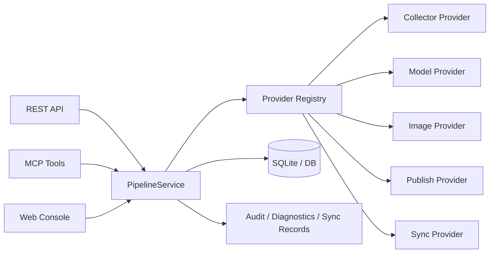

# Rednote Agent Pro

> A provider-oriented Xiaohongshu content operations system built for **spec-driven**, **agent-assisted**, and **small-scale controllable** development.

[](#getting-started)
[](#architecture)
[](#quality-status)
[](#safety-defaults)

---

## Table of Contents

- [What this project is](#what-this-project-is)
- [Why this repo is different](#why-this-repo-is-different)
- [Architecture](#architecture)
- [Core capabilities](#core-capabilities)
- [How to develop this project with OpenSpec + oh-my-codex](#how-to-develop-this-project-with-openspec--oh-my-codex)
- [Recommended day-to-day workflow](#recommended-day-to-day-workflow)
- [Getting started](#getting-started)
- [Environment configuration](#environment-configuration)
- [Run the system](#run-the-system)
- [REST / MCP / Web Console](#rest--mcp--web-console)
- [Repository structure](#repository-structure)
- [Safety defaults](#safety-defaults)
- [Quality status](#quality-status)
- [Documentation map](#documentation-map)
- [Current real-world blockers](#current-real-world-blockers)

---

## What this project is

**Rednote Agent Pro** is a modular Xiaohongshu workflow system for:

- collecting source posts from Xiaohongshu
- analyzing high-performing content patterns
- generating topics and drafts with configurable model providers
- reviewing before publish
- recording publish jobs, sync records, diagnostics, and audits
- syncing outputs to Feishu through CLI-based adapters

This repository is intentionally designed as a **single business hub** with multiple operator surfaces:

- **REST API**
- **MCP tools**
- **Web Console**

All three surfaces share the same application service layer instead of duplicating business logic.

---

## Why this repo is different

This repo is not just “an AI app.” It is structured for **long-running, spec-first project delivery**.

It combines two workflows:

1. **OpenSpec** → defines what should be built
2. **oh-my-codex** → helps execute the work with disciplined agent workflows, skills, plans, and verification

That combination is the main development philosophy of this project.

---

## Architecture



### Design principles

- **Do not hardcode external vendors into business logic**
- **Everything external goes through provider / adapter / registry**
- **Dry-run first, manual review first, live publish off by default**
- **All high-risk actions must be observable and auditable**
- **REST / MCP / Web Console must stay on the same service layer**

---

## Core capabilities

### 1. Scrapling-based collector provider

Provider key: `scrapling_xhs`

Current support:

- `search`
- `detail`

Implemented as an internal provider, not as a separate product bolted onto the side.

### 2. Feishu sync through `lark-cli`

Provider key: `feishu_cli`

Current support:

- Base-first sync mode
- dry-run path
- command builder
- result parser
- sync records + diagnostics

### 3. Switchable model provider

Provider keys:

- `openai_compatible`
- `custom_model_router`
- `mock`

Current support:

- analyze
- topic suggestion
- draft generation
- optional image-provider family with matching OpenAI-compatible env structure

---

# How to develop this project with OpenSpec + oh-my-codex

This is the most important section of this README.

If you want to continue building this project correctly, the recommended approach is:

## OpenSpec decides **what** to build

Use OpenSpec to:

- define a change before implementation
- document architecture and constraints
- break work into tasks
- keep the repo aligned with intended scope
- avoid random undocumented feature drift

In practice, OpenSpec is where you write and refine:

- design
- specs
- tasks
- acceptance expectations

For this repo, OpenSpec should be used whenever you are doing any meaningful feature or architecture change, especially when touching:

- providers
- workflow stages
- contracts
- diagnostics / audit model
- REST / MCP / Web shared business paths

## oh-my-codex decides **how** to execute the work

Use oh-my-codex to:

- load the right workflow skill for the current task
- enforce planning before implementation
- enforce debugging discipline before patching bugs
- enforce testing/verification before calling work “done”
- coordinate subagents, plans, and execution loops when needed

In this repo, oh-my-codex is especially useful for:

- repository audits
- implementing OpenSpec task lists
- refactoring provider integrations safely
- writing runbooks and acceptance docs
- preparing GitHub-ready delivery branches

## The right mental model

Use them together like this:

| Layer | Responsibility |
|---|---|
| OpenSpec | define the change clearly |
| oh-my-codex | execute the change with disciplined workflows |
| app code | implement the architecture |
| tests/docs | prove and explain the result |

---

## Recommended day-to-day workflow

### Step 1: start from a spec, not a vague idea

When you want to add or change something substantial:

1. create or refine the OpenSpec change
2. make sure design / specs / tasks are explicit
3. clarify constraints before touching code

Typical examples in this repo:

- adding a new provider
- changing workflow stages
- extending sync targets
- adding a new publish channel
- changing review gates

### Step 2: use oh-my-codex skills intentionally

Common skill patterns for this repo:

- **brainstorming** → before creative feature work
- **writing-plans** / **openspec-propose** / **openspec-apply-change** → when turning requirements into implementation
- **systematic-debugging** → before bug fixes
- **verification-before-completion** → before claiming success
- **github:yeet** → when publishing the branch to GitHub

The key idea: do not jump straight into coding. Let the workflow discipline shape the implementation.

### Step 3: implement through the existing architecture

For this project, implementation should usually follow this order:

1. `contracts`
2. `config`
3. `provider`
4. `registry`
5. `service wiring`
6. `REST / MCP / Web`
7. `tests`
8. `docs`

That sequence keeps the system coherent and avoids leaking external vendor logic into business services.

### Step 4: verify before calling it done

Before finishing a change:

- run tests
- check diagnostics surfaces
- check docs and `.env.example`
- confirm safety defaults still hold
- confirm no external integration bypassed the provider registry

### Step 5: publish intentionally

When pushing work:

- review scope
- stage only intended changes
- commit clearly
- push to GitHub
- prefer draft PRs unless explicitly ready for review

---

## Example: adding a new provider correctly

If you want to add another provider later, the recommended OpenSpec + oh-my-codex path is:

1. **OpenSpec**: define the new provider change
2. document:
   - provider purpose
   - business boundaries
   - env contract
   - safety behavior
   - diagnostics expectations
3. **oh-my-codex**: use planning/execution skills to implement
4. update:
   - `app/domain/contracts.py`
   - `app/core/config.py`
   - `app/infrastructure/providers/...`
   - `app/infrastructure/providers/registry.py`
   - `app/application/services.py`
   - REST / MCP / Web surfaces
   - tests
   - docs

This is exactly how the current Scrapling, lark-cli, and configurable model-provider integrations were approached.

---

## Getting started

### 1. Clone

```bash
git clone https://github.com/FRANKOUST/Rednote-agent-pro.git
cd Rednote-agent-pro
```

### 2. Create env file

```bash
cp .env.example .env
```

### 3. Install

```bash
pip install -e .[dev]
```

If you want live Scrapling fetchers later:

```bash
pip install -e .[collectors]
scrapling install
```

### 4. Verify

```bash
pytest -q
```

---

## Environment configuration

### Collector

```env
XHS_DEFAULT_COLLECTOR_PROVIDER=scrapling_xhs
XHS_SCRAPLING_MODE=fixture
XHS_SCRAPLING_TIMEOUT_SECONDS=30
XHS_SCRAPLING_COOKIES_PATH=./data/scrapling/cookies.json
XHS_SCRAPLING_STORAGE_STATE_PATH=./data/scrapling/storage_state.json
```

### Sync

```env
XHS_DEFAULT_SYNC_PROVIDER=feishu_cli
XHS_FEISHU_CLI_BIN=lark-cli
XHS_FEISHU_CLI_AS=user
XHS_FEISHU_SYNC_MODE=base
XHS_FEISHU_CLI_DRY_RUN=true
XHS_FEISHU_BASE_TOKEN=
XHS_FEISHU_TABLE_ID=
```

### Model

```env
XHS_DEFAULT_MODEL_PROVIDER=custom_model_router
XHS_MODEL_API_KEY=
XHS_MODEL_BASE_URL=https://api.openai.com/v1
XHS_MODEL_NAME=gpt-4.1-mini
XHS_MODEL_TIMEOUT_SECONDS=60
XHS_MODEL_MAX_RETRIES=2
XHS_MODEL_TEMPERATURE=0.2
```

---

## Run the system

### Start app

```bash
uvicorn app.main:app --reload
```

### Open the Web Console

- `http://127.0.0.1:8000/`

### Useful local actions

- run dry pipeline
- trigger Scrapling search
- trigger Scrapling detail
- trigger Feishu sync dry-run
- inspect provider health / diagnostics

---

## REST / MCP / Web Console

### REST highlights

- `POST /api/pipeline-runs`
- `POST /api/collector-runs/search`
- `POST /api/collector-runs/detail`
- `POST /api/sync-runs`
- `GET /api/providers/status`
- `GET /api/pipeline-runs/{id}/diagnostics`

### MCP tools

- `start_pipeline`
- `start_collector_search`
- `start_collector_detail`
- `start_sync_run`
- `get_provider_status`

### Web Console pages

- `/`
- `/console/entities`
- `/console/collector-runs`
- `/console/sync-runs`
- `/console/providers`

---

## Repository structure

```text
app/
  application/      shared orchestration, dispatcher, worker control
  core/             config + middleware
  db/               persistence models + session
  domain/           contracts + payload schemas
  infrastructure/   providers, registry, adapters
  interfaces/       REST, MCP, Web
config/             mapping config
fixtures/           dry-run / parser fixtures
templates/          Web Console templates
tests/              unit + integration tests
docs/               portfolio + planning artifacts
```

---

## Safety defaults

- collector defaults to fixture/dry-run mode
- sync defaults to dry-run
- live publish remains gated
- manual review remains required before publish
- schema validation is mandatory for model output
- audit logs and diagnostics remain first-class outputs

---

## Quality status

Current verified state:

- provider-oriented architecture preserved
- Scrapling collector integrated
- lark-cli sync integrated
- configurable model provider integrated
- REST / MCP / Web share one business layer
- **`pytest -q` → 54 passed**

---

## Documentation map

- [`SCRAPLING_INTEGRATION.md`](./SCRAPLING_INTEGRATION.md)
- [`FEISHU_CLI_INTEGRATION.md`](./FEISHU_CLI_INTEGRATION.md)
- [`MODEL_PROVIDER_INTEGRATION.md`](./MODEL_PROVIDER_INTEGRATION.md)
- [`REAL_OPS_READINESS.md`](./REAL_OPS_READINESS.md)
- [`OPERATOR_RUNBOOK.md`](./OPERATOR_RUNBOOK.md)
- [`PROVIDER_INTEGRATION_MATRIX.md`](./PROVIDER_INTEGRATION_MATRIX.md)
- [`ACCEPTANCE_CHECKLIST.md`](./ACCEPTANCE_CHECKLIST.md)
- [`DEMO.md`](./DEMO.md)
- [`SHOWCASE.md`](./SHOWCASE.md)

---

## Current real-world blockers

The codebase is ready for controlled small-scale validation, but real-world verification still needs:

1. authenticated Scrapling/XHS session material
2. authenticated `lark-cli` setup for Feishu
3. one real OpenAI-compatible provider key/base_url/model

Once those are provided, the remaining work is live verification, validation reporting, and final acceptance closeout.
